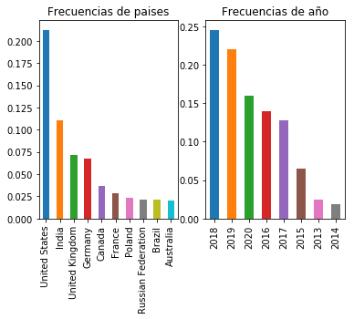

## Análisis descriptivo de encuesta anual para desarrolladores de Stack Overflow

Este es un pequeño análisis de [Encuesta anual para desarrolladores de Stack Overflow](https://insights.stackoverflow.com/survey), la cual se aplica a mas de  180 países, con el tema centrado en la situación de los desarrolladores, satisfacción, intereses y opiniones.

### Los posibles tópicos de la encuesta

Esta encuesta tiene mucho tema que explotar, las opiniones e intereses de los desarrolladores pueden generar tendencias para su análisis. En este blog solo se toman 3 preguntas como un pequeño ejemplo de que podria estudiarse. 
* **¿Que países han tenido mayor aumento en la ultima encuesta?**
* **¿cual es el nivel de educación que tiene el peor y cual el mejor porcentaje de empleo ?**
* **poder dislumbrar la tendencia en el lenguaje mas deseado de aprender** 

Para poder desarrollar las preguntas, veamos algunos resultados que podrán generar conclusiones tangibles.

### ¿Que países han tenido mayor aumento en la ultima encuesta?

Para este item, unimos las respuestas a la encuesta desde el año 2013 al 2020. Resultando en una base con _403.094_ registros, siendo ya una bateria de información de un buen tamaño.

