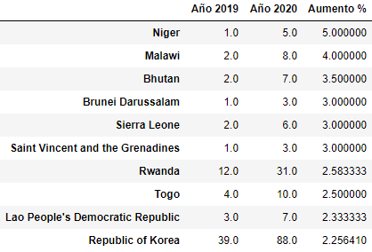
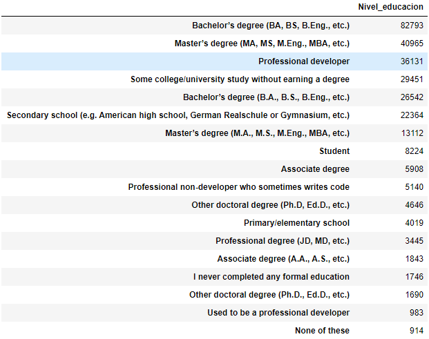
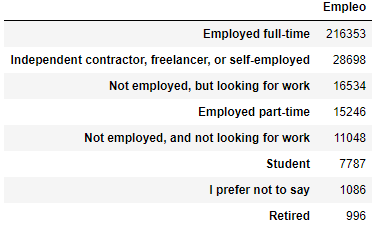
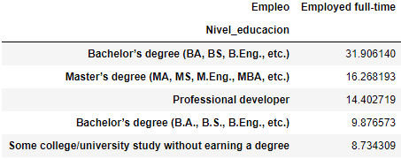
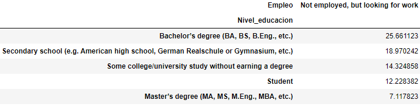
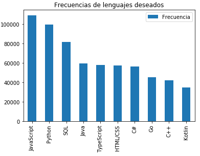
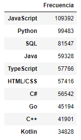

## Análisis descriptivo de encuesta anual para desarrolladores de Stack Overflow

Este es un pequeño análisis de [Encuesta anual para desarrolladores de Stack Overflow](https://insights.stackoverflow.com/survey), la cual se aplica a mas de  180 países, con el tema centrado en la situación de los desarrolladores, satisfacción, intereses y opiniones.

### Los posibles tópicos de la encuesta

Esta encuesta tiene mucho tema que explotar, las opiniones e intereses de los desarrolladores pueden generar tendencias para su análisis. En este blog solo se toman 3 preguntas como un pequeño ejemplo de que podria estudiarse. 
* **¿Que países han tenido mayor aumento en la ultima encuesta?**
* **¿cual es el nivel de educación que tiene el peor y cual el mejor porcentaje de empleo ?**
* **poder dislumbrar la tendencia en el lenguaje mas deseado de aprender** 

Para poder desarrollar las preguntas, veamos algunos resultados que podrán generar conclusiones tangibles.

### ¿Que países han tenido mayor aumento en la ultima encuesta?

Para este item, unimos las respuestas a la encuesta desde el año 2013 al 2020. Resultando en una base con _403.094_ registros, siendo ya una bateria de información de un buen tamaño.

Aunque es claro quienes dominan la opinión en esta encuesta, veamos cuales fueron los pa'ises que aceleraron en este último año:

Es entonces la respuesta que buscabamos, aunque, el aumento se da porque sus números son muy bajos en el año 2019. En otras palabras, la magnitud de estos países no es comparable, pero, obtenemos una conclsuión nueva, y es que estos paises que no logran una alta participación en el munda de la data, estan iniciando su proceso con aceleración (_no la deseada_). 

### ¿Cual es el nivel de educación que tiene el peor y cual el mejor porcentaje de empleo?

Para este item, se unieron las respuestas desde el año2017 al 2020, ya que en las encuestas anteriores no se contaba con una pregunta que se pudiera homologar a estas. Veamos una descripción del nivel de educación y nivel de empleo:

Para poder obtener una tabla qeu sea útil a la pregunta, debemos cruzar con la tipologia que nos itneresa, la de empleado y desempleado, asi:

Se ve que el porcentaje mas alto en empleados y desempleados es el bachillerato, posible resultado por la cantidad de participantes de este segmento. Sin embargo, se denota que la participación de un master es alta en empleados, y cursos sin terminar o aun en estudios tienen el mayor porcentaje en desempleados.

### Dislumbrar la tendencia en el lenguaje mas deseado de aprender

Si se quiere replicar este ejercicio, se debe tener cuidado con la variables a estudiar, ya que la respuesta viene unida con caracteres de punto y coma. Después de lograr esa separación, recordando que este ejercicio se hace con los últimos 3 años de estudio, obtenemos:

Con esto, podemos ver que JavaScript y python estan liderando los lenguajes con deseo de aprendizaje.
